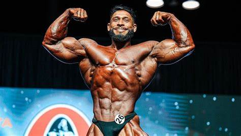

# 👑 O Cara Mais Capacitado do Mundo

*O Dinossauro do Acre, ícone do fisiculturismo brasileiro.*
#↑↑↑ESSE CABA É BOM!!!↑↑↑
---

## Sobre Mim

Sou um profissional apaixonado por tecnologia, inovação e soluções que transformam ideias em realidade. Com uma vasta experiência em diversas áreas do desenvolvimento de software, engenharia, liderança técnica e empreendedorismo, entrego resultados que ultrapassam expectativas.

Tenho um compromisso inabalável com a qualidade, aprendizado contínuo e impacto positivo, sempre buscando o próximo desafio para elevar ainda mais o nível.

---

## Habilidades Principais

- 💻 **Desenvolvimento Full-Stack:** Domínio absoluto em diversas linguagens e frameworks (JavaScript, Python, Java, Go, React, Node.js, etc.)
- 🚀 **Arquitetura de Software:** Projetos escaláveis, seguros e de alta performance.
- 🤖 **Inteligência Artificial & Machine Learning:** Implementação de modelos avançados e soluções inteligentes.
- ☁️ **Cloud Computing:** AWS, Azure, Google Cloud — expertise em infraestrutura e DevOps.
- 🔒 **Segurança da Informação:** Práticas e padrões para proteger dados e sistemas.
- 🧠 **Liderança & Mentoria:** Inspirando equipes a superar metas e crescer profissionalmente.
- 📈 **Metodologias Ágeis:** Scrum, Kanban e cultura DevOps para acelerar entregas.

---

## Vamos Conectar?

Estou sempre aberto para trocar ideias, colaborar em projetos desafiadores e construir o futuro juntos.

- 📫 [Email profissional]
- 🌐 [LinkedIn]
- 🐦 [Twitter]

---

## Curiosidade

> "O segredo da maestria está na prática constante e no desejo incansável de aprender." — O Cara Mais Capacitado do Mundo

---

Se gostou, siga o perfil e acompanhe as novidades!

